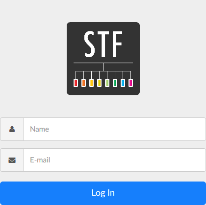

Using HypriotOS to run openSTF local
====================================

<span id="anchor"></span>Installation
-------------------------------------

### <span id="anchor-1"></span>Hypriot Docker Image for Raspberry Pi

Download and flash this image to your SD card.
Start your Pi with the flashed SD card and enjoy instant Docker awesomeness.
The latest releases can always be found on [GitHub](https://github.com/hypriot/image-builder-rpi/releases).

The default credentials for the image are user **pirate** with password **hypriot**.

|               |                                                                                                                                                                                                                                                          |                                   |            |
|---------------|----------------------------------------------------------------------------------------------------------------------------------------------------------------------------------------------------------------------------------------------------------|-----------------------------------|------------|
| Description   | Download Link                                                                                                                                                                                                                                            | Description                       | Published  |
| Version 1.9.0 | [hypriotos-rpi-v1.9.0.img.zip](https://github.com/hypriot/image-builder-rpi/releases/download/v1.9.0/hypriotos-rpi-v1.9.0.img.zip) [Checksum](https://github.com/hypriot/image-builder-rpi/releases/download/v1.9.0/hypriotos-rpi-v1.9.0.img.zip.sha256) | Docker 18.04.0-ce, kernel 4.14.34 | 28.04.2018 |

I used [Etcher](https://github.com/resin-io/etcher/releases/download/v1.3.1/Etcher-Setup-1.3.1-x64.exe) to write this image.
I plugged the Raspi into Ethernet, a power plug, and a few seconds later tried

```
$ ssh pirate@black-pearl
pirate@black-pearl's password:
Linux black-pearl 4.14.34-hypriotos-v7+ \#1 SMP Sun Apr 22 14:57:31 UTC 2018 armv7l
HypriotOS (Debian GNU/Linux 9)
The programs included with the Debian GNU/Linux system are free software;
the exact distribution terms for each program are described in the
individual files in /usr/share/doc/\*/copyright.
Debian GNU/Linux comes with ABSOLUTELY NO WARRANTY, to the extent
permitted by applicable law.
HypriotOS/armv7: pirate@black-pearl in ~
```

I'm using DHCP, so I had to find the IP of the Raspi to change the configuration later on:

```
ifconfig
docker0: flags=4099&lt;UP,BROADCAST,MULTICAST&gt; mtu 1500
 inet 172.17.0.1 netmask 255.255.0.0 broadcast 172.17.255.255
 ether 02:42:b0:d0:bf:fa txqueuelen 0 (Ethernet)
 RX packets 0 bytes 0 (0.0 B)
 RX errors 0 dropped 0 overruns 0 frame 0
 TX packets 0 bytes 0 (0.0 B)
 TX errors 0 dropped 0 overruns 0 carrier 0 collisions 0
eth0: flags=4163&lt;UP,BROADCAST,RUNNING,MULTICAST&gt; mtu 1500
 inet ip.of.your.raspberry netmask 255.255.248.0 broadcast ip.of.your.broadcast
 inet6 fe80::1096:713d:a542:dfbb prefixlen 64 scopeid 0x20&lt;link&gt;
 ether b8:27:eb:4b:11:0d txqueuelen 1000 (Ethernet)
 RX packets 7423 bytes 1021610 (997.6 KiB)
 RX errors 0 dropped 22 overruns 0 frame 0
 TX packets 291 bytes 50988 (49.7 KiB)
 TX errors 0 dropped 0 overruns 0 carrier 0 collisions 0
lo: flags=73&lt;UP,LOOPBACK,RUNNING&gt; mtu 65536
 inet 127.0.0.1 netmask 255.0.0.0
 inet6 ::1 prefixlen 128 scopeid 0x10&lt;host&gt;
 loop txqueuelen 1000 (Local Loopback)
 RX packets 70 bytes 5718 (5.5 KiB)
 RX errors 0 dropped 0 overruns 0 frame 0
 TX packets 70 bytes 5718 (5.5 KiB)
 TX errors 0 dropped 0 overruns 0 carrier 0 collisions 0
wlan0: flags=4099&lt;UP,BROADCAST,MULTICAST&gt; mtu 1500
 ether b8:27:eb:1e:44:58 txqueuelen 1000 (Ethernet)
 RX packets 0 bytes 0 (0.0 B)
 RX errors 0 dropped 0 overruns 0 frame 0
 TX packets 0 bytes 0 (0.0 B)
 TX errors 0 dropped 0 overruns 0 carrier 0 collisions 0
 ```
 I wanted to run openSTF from `/DATA` so I created it.
 
 ```
sudo mkdir /DATA
cd /DATA
sudo chown -R pirate /DATA/
```

<span id="anchor-2"></span>Git
------------------------------

### <span id="anchor-3"></span>Proxy
I'm unfortunate enough to work behind a proxy, so we will have to configure it at several places. Let's start with `apt` to fetch updates and install new packages

```
sudo nano /etc/apt/apt.conf
```

in which you will find
```
Acquire::http::Proxy "http://your.proxy.host:proxyPort";
```

### <span id="anchor-4"></span>curl-config
We will then be able to install curl-config:

```
sudo -E apt-get update && apt-get install --reinstall libcurl4-openssl-dev
```

This will be needed later on to accept github certificate (or try to).

### <span id="anchor-5"></span>Certificates
The first time I tried to clone the openSTF armv7 repo, I got an error saying my certificates could not be found.
Of course, [Stackoverflow](https://stackoverflow.com/questions/21181231/server-certificate-verification-failed-cafile-etc-ssl-certs-ca-certificates-c) got it covered.
So I tried

```
hostname=github.com
port=443
trust_cert_file_location=`curl-config --ca`
```

We'll try to import the github certificate on our machine. If you also have a proxy, put on the command line:

```
sudo bash -c "echo -n | openssl s\_client -proxy your.proxy.host:proxyPort -showcerts -connect $hostname:$port \\
 2>/dev/null | sed -ne '/-BEGIN CERTIFICATE-/,/-END CERTIFICATE-/p' \\
 >>; $trust\_cert\_file\_location"
```
If you don't need any proxy, just get rid of the `-proxy` part.

As it is not working yet, we do `export GIT_SSL_NO_VERIFY=1` which is not an pretty solution. We will have to investigate later on.
The solution to this issue is written somewhere in [https://stackoverflow.com/questions/42616392/unable-to-correct-sudden-server-certificate-verification-failed](https://stackoverflow.com/questions/42616392/unable-to-correct-sudden-server-certificate-verification-failed)* or [https://stackoverflow.com/questions/35821245/github-server-certificate-verification-failed/35824116\#35824116](https://stackoverflow.com/questions/35821245/github-server-certificate-verification-failed/35824116#35824116).

Now, we can at last clone the repo:

```
HypriotOS/armv7: pirate@black-pearl in /DATA
ALL_PROXY=http://your.proxy.host:proxyPort git clone https://github.com/jonathas/openstf-arm7-docker
Cloning into 'openstf-arm7-docker'...
remote: Counting objects: 10, done.
remote: Total 10 (delta 0), reused 0 (delta 0), pack-reused 10
Unpacking objects: 100% (10/10), done.
```

### <span id="anchor-6"></span>Proxy for Docker
The repo is now available, but we will need to configure Docker to use the proxy because it won't be able to download the images:

```
docker-compose up --build
Pulling adb (mitchtech/arm-adb:)...
ERROR: Get https://registry-1.docker.io/v2/: net/http: request canceled while waiting for connection (Client.Timeout exceeded while awaiting headers)
```

We will have to create a docker.service.d directory in which we will create http-proxy.conf and https-proxy.conf.

```
sudo mkdir -p /etc/systemd/system/docker.service.d/
sudo vi /etc/systemd/system/docker.service.d/http-proxy.conf
sudo vi /etc/systemd/system/docker.service.d/https-proxy.conf
cat /etc/systemd/system/docker.service.d/https-proxy.conf
[Service]
Environment="HTTPS_PROXY=http://your.proxy.host:proxyPort"
```

Then we can ask Docker daemon to reload the config:

```
sudo systemctl daemon-reload
```

and if it doesn't work yet (which should not happen), we can restart Docker:

```
sudo systemctl restart docker
```
We can then check that the properties have been taken into account:

```
systemctl show --property=Environment docker
Environment=HTTP_PROXY=http://your.proxy.host:proxyPort HTTPS_PROXY=http://your.proxy.host:proxyPort
```
As everything now looks in order, we can launch openSTF:

```
docker-compose up --build
Pulling adb (mitchtech/arm-adb:)...
latest: Pulling from mitchtech/arm-adb
991507d4dcc6: Downloading \[=====&gt; \] 3.385MB/32.88MB
2ad44321f88a: Download complete
2f39bd897657: Download complete
a3ed95caeb02: Download complete
38949773330c: Downloading \[======&gt; \] 1.702MB/12.22MB
a6ac660d9104: Download com
### Launching openSTF
```

We can stop it, as we still have some configuration to do.
In the [openstf-arm7-docker](https://github.com/jonathas/openstf-arm7-docker) the Readme reads:
- Open the docker-compose.yml file and **edit the ip address there, entering your server's ip address instead**

So, 
- change the IP with the one you found with `ifconfig` earlier.
- copy the docker-infra.service file from the systemd directory to /etc/systemd/system `$ sudo cp systemd/docker-infra.service /etc/systemd/system`
- modify it so that it corresponds to your directory: 

```
vi systemd/docker-infra.service
HypriotOS/armv7: pirate@black-pearl in /DATA/openstf-arm7-docker
$ cat !$
cat systemd/docker-infra.service
[Unit]
Description=Docker infra
Requires=docker.service
After=docker.service

[Service]
Restart=always
ExecStart=/usr/local/bin/docker-compose -f /DATA/openstf-arm7-docker/docker-compose.yml up
ExecStop=/usr/local/bin/docker-compose -f /DATA/openstf-arm7-docker/docker-compose.yml stop

[Install]
WantedBy=default.target
```

- reload the daemons: `sudo systemctl daemon-reload`
- enable the service: `sudo systemctl enable docker-infra`
- start everything: `sudo systemctl start docker-infra`

After everything is loaded, your server will be available on http://ip.of.your.raspberry:7100

So :

version: "2"

services:

 stf:

 image: openstf/stf-armv7l

 privileged: true

 container\_name: openstf

 depends\_on:

 - db

 - adb

 network\_mode: host

 command: "stf local --public-ip ip.of.your.raspberry"

 db:

 image: generalmeow/rethinkdb:1.0-arm

 container\_name: openstf\_db

 volumes:

 - "./rethinkdb\_data:/data"

 network\_mode: host

 adb:

 image: mitchtech/arm-adb

 privileged: true

 container\_name: adb

 network\_mode: host

networks:

 default:

 external:

 name: "host"

et

** **docker-compose up --build

and… Tadaam :




